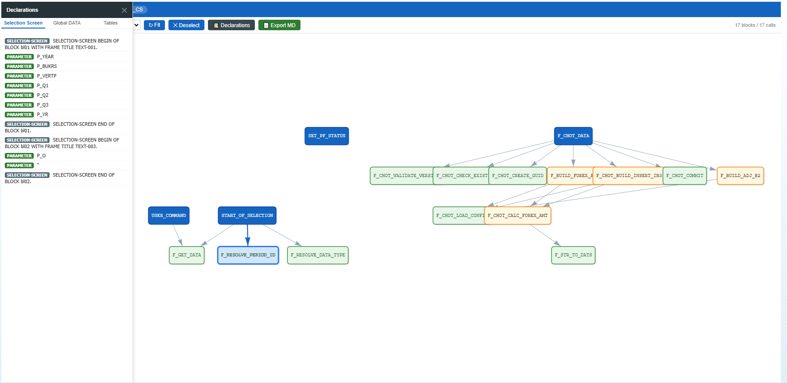

# ZSUBROUTINE_CALL_GRAPH
 
## Mô tả
 
`ZSUBROUTINE_CALL_GRAPH` là công cụ phân tích tĩnh (static analysis) cho chương trình ABAP. Nhập tên một program bất kỳ, chương trình sẽ tự động scan toàn bộ source code (kể cả các INCLUDE đệ quy), xây dựng đồ thị lời gọi giữa các FORM subroutine và event block, rồi hiển thị kết quả dưới dạng interactive HTML graph trong SAP GUI.
 
Ngoài call graph, chương trình còn thu thập cấu trúc dữ liệu (global DATA/TYPES, selection screen, cấu trúc bảng DB từ Data Dictionary) và cho phép export toàn bộ thông tin thành file Markdown — sẵn sàng dùng làm context cho AI (Claude, Copilot v.v.) để hỗ trợ vibe coding, refactor, hoặc phân tích logic.
 
---
 
## Tính năng
 
### 1. Call Graph tương tác
- Hiển thị đồ thị FORM → FORM qua vis.js, chạy trong `CL_GUI_HTML_VIEWER` nhúng trong SAP GUI
- Color coding phân loại node:
  - **Xanh dương** — Root (entry point, không được gọi bởi FORM nào)
  - **Xanh lá** — Leaf (không gọi FORM nào khác)
  - **Vàng** — Middle (vừa gọi vừa được gọi)
  - **Tím** — Orphan / isolated (không kết nối)
- Layout Hierarchical (Top-Down / Left-Right) hoặc Physics (tự do)
- Click node → highlight toàn bộ kết nối, ẩn mờ node không liên quan
- Double-click node → mở Source Code Modal
### 2. Source Code Modal
- Hiện source code của từng FORM/block với syntax highlighting ABAP (keyword, string literal, comment, số)
- Đánh số dòng
- Badge hiển thị số lời gọi đi (calls) và số nơi gọi đến (callers)
### 3. Declarations Sidebar
Mở bằng nút **Declarations** trên toolbar, gồm 3 tab:
 
| Tab | Nội dung |
|-----|----------|
| **Selection Screen** | Tất cả `PARAMETERS`, `SELECT-OPTIONS`, `SELECTION-SCREEN` block |
| **Global DATA** | Toàn bộ khai báo `DATA`, `TYPES`, `CONSTANTS` ở top-level và trong các INCLUDE |
| **Tables** | Cấu trúc field của các bảng DB phát hiện được (từ `DD03L`/`DD03T`), key field highlight xanh |
 
### 4. Export Markdown cho AI
Nút **Export MD** tạo file `<program>_context.md` gồm:
- Header hướng dẫn cho Claude/AI
- Selection Screen (dạng code block ABAP)
- Global Declarations
- Database Table Structures (dạng markdown table, field/type/len/description)
- Call Graph (dạng cây DFS text)
- Refactor Hints tự động (dead code, god routine, high coupling, trivial wrapper)
- Source Code từng block (thứ tự: root → middle → leaf → orphan)
---
 
## Cách sử dụng
 
1. Chạy transaction `SE38` → nhập `ZSUBROUTINE_CALL_GRAPH` → Execute (F8)
2. Nhập tên program cần phân tích vào field **Program Name**
3. Nhấn Execute → HTML viewer tự mở với call graph
4. Tương tác:
   - **Click** node để xem call/caller và highlight
   - **Double-click** hoặc nhấn nút **View Source** để đọc code
   - **Declarations** để xem data structure
   - **Export MD** để lấy file context cho AI
   - **Fit** để zoom vừa màn hình
   - Đổi layout giữa Hierarchical / Physics
---
 
## Kiến trúc kỹ thuật
 
### Luồng xử lý chính
 
```
START-OF-SELECTION
  └─ F_SCAN_PROGRAM
       ├─ F_READ_SOURCE (đệ quy qua INCLUDEs)
       │    ├─ Detect FORM/ENDFORM → gt_forms, gt_form_src
       │    ├─ Detect event blocks (START-OF-SELECTION, MODULE...) → gt_forms
       │    ├─ Detect PERFORM → gt_calls
       │    └─ Detect TYPE TABLE OF Z*/Y* → gt_db_tables
       ├─ F_SCAN_GLOBALS (loop qua tất cả progs đã scan)
       │    ├─ Statement accumulator: gom multi-line → parse 1 lần
       │    ├─ PARAMETERS/SELECT-OPTIONS → gt_sel_screen
       │    ├─ DATA/TYPES/CONSTANTS → gt_data_decls
       │    ├─ FROM clause → gt_db_tables
       │    └─ TYPE Z*/Y* reference → gt_db_tables
       └─ F_READ_TABLE_STRUCTURES
            └─ DD03L + DD03T → gt_table_fields
  └─ F_DISPLAY_HTML
       └─ CALL SCREEN 100
            └─ MODULE STATUS_0100 OUTPUT
                 ├─ F_BUILD_SRC_JSON    → srcMap JS object
                 ├─ F_BUILD_CONTEXT_JSON → ctxData JS object
                 └─ F_BUILD_HTML        → HTML string → CL_GUI_HTML_VIEWER
```
 
### Các FORM và vai trò
 
| FORM | Vai trò |
|------|---------|
| `F_SCAN_PROGRAM` | Orchestrator: gọi 3 bước scan theo thứ tự |
| `F_READ_SOURCE` | Scan source đệ quy qua INCLUDEs; thu thập FORM, event block, PERFORM call, type reference |
| `F_SCAN_GLOBALS` | Scan declarations top-level dùng statement accumulator; thu thập PARAMETERS, DATA, TYPES, FROM clause |
| `F_PARSE_STATEMENT` | Parse 1 statement hoàn chỉnh (có thể span nhiều dòng); tách items theo colon/comma syntax |
| `F_READ_TABLE_STRUCTURES` | Đọc DD field metadata từ `DD02L`/`DD03L`/`DD03T` cho tất cả bảng phát hiện |
| `F_BUILD_SRC_JSON` | Serialize `gt_form_src` thành JSON map `{"FORM_NAME":"source..."}` |
| `F_BUILD_CONTEXT_JSON` | Serialize declarations + table structures thành JSON `{sel_screen, globals, tables}` |
| `F_ESCAPE_JSON` | Escape `\`, `"`, newline, tab cho JSON string value |
| `F_DISPLAY_HTML` | Validate rồi gọi SCREEN 100 |
| `F_BUILD_HTML` | Tạo toàn bộ HTML string (CSS + vis.js + JS logic + export) nhúng dữ liệu JSON inline |
| `MODULE STATUS_0100 OUTPUT` | Build JSON, render HTML, load vào `CL_GUI_HTML_VIEWER` |
| `MODULE USER_COMMAND_0100 INPUT` | Xử lý BACK/EXIT/CANCEL |
 
### Kỹ thuật đáng chú ý
 
**Statement Accumulator (`F_SCAN_GLOBALS`)**
Thay vì parse từng dòng, chương trình gom tất cả dòng của 1 statement vào buffer cho đến khi gặp dấu `.` cuối, rồi parse 1 lần. Giải quyết đúng cả 3 dạng syntax ABAP:
```abap
DATA gt_data TYPE TABLE OF ztb_xxx.          " single-line
DATA: lv_a TYPE i,                            " colon, multi-line
      lv_b TYPE string.
PARAMETERS:
  p_bukrs TYPE bukrs,
  p_year  TYPE gjahr OBLIGATORY.             " continuation lines
```
 
**Include đệ quy với dedup**
`F_READ_SOURCE` dùng `GT_SCANNED_PROGS` để tránh scan lại cùng một include, ngăn vòng lặp vô hạn với các include lồng nhau.
 
**Dual scan cho globals**
Sau khi `F_READ_SOURCE` hoàn thành, `F_SCAN_PROGRAM` loop qua toàn bộ `GT_SCANNED_PROGS` (main prog + tất cả includes) để chạy `F_SCAN_GLOBALS` — đảm bảo bắt được khai báo trong `*TOP` include và bất kỳ include nào khác.
 
**Type reference detection**
Scan `TYPE TABLE OF Zxxx`, `TYPE Zxxx`, `LIKE TABLE OF Yxxx` trên mọi dòng source (cả trong FORM lẫn top-level) để tự động phát hiện bảng Z/Y cần đọc DD.
 
**HTML chunking**
HTML string dài được cắt thành các chunk 255 ký tự trước khi truyền vào `CL_GUI_HTML_VIEWER→LOAD_DATA` (giới hạn của kiểu `CHAR255`).
 
**STATICS cho GUI objects**
`LO_CONTAINER` và `LO_VIEWER` khai báo `STATICS` trong module OUTPUT để tránh bị garbage collect giữa các lần PBO.
 
---
 
## Cấu trúc dữ liệu nội bộ
 
| Global table | Kiểu | Nội dung |
|---|---|---|
| `GT_SCANNED_PROGS` | `TABLE OF programm` | Danh sách prog/include đã scan (dedup) |
| `GT_FORMS` | `TABLE OF ty_form` | Tất cả FORM và event block phát hiện |
| `GT_CALLS` | `TABLE OF ty_call` | Cặp (caller, callee) |
| `GT_FORM_SRC` | `TABLE OF ty_form_src` | Từng dòng source, gắn với form_name |
| `GT_DATA_DECLS` | `TABLE OF ty_data_decl` | Global DATA/TYPES/CONSTANTS |
| `GT_SEL_SCREEN` | `TABLE OF ty_data_decl` | PARAMETERS, SELECT-OPTIONS, SELECTION-SCREEN |
| `GT_DB_TABLES` | `TABLE OF string` | Tên bảng DB cần tra DD |
| `GT_TABLE_FIELDS` | `TABLE OF ty_table_field` | Fields từ DD03L/DD03T |
 
---
 
## Yêu cầu kỹ thuật
 
- SAP NetWeaver / S/4HANA (ABAP 7.4+)
- Screen 100 với Custom Container tên `MAIN_AREA`
- PF-Status `STAT100` với function code BACK/EXIT/CANCEL
- Title `TITLE100`
- Quyền đọc source program (`READ REPORT`) và DD (`DD02L`, `DD03L`, `DD03T`)
- Browser engine trong SAP GUI (cho HTML viewer — Internet Explorer hoặc Edge WebView2 tùy phiên bản)
---
 
## Giới hạn hiện tại
 
- Chỉ phát hiện `PERFORM <name>` tĩnh; `PERFORM (lv_var) IN PROGRAM` hoặc dynamic call không được bắt
- Event block không có keyword kết thúc tường minh — boundary được suy ra khi gặp FORM/MODULE tiếp theo
- Bảng standard SAP (không bắt đầu Z/Y) từ `TYPE TABLE OF` không được tra DD (chỉ phát hiện qua `FROM` clause trong SELECT)
- HTML viewer phụ thuộc vào browser engine của SAP GUI — một số feature JS hiện đại có thể không hoạt động trên IE11
---
 
## Lịch sử phát triển (tóm tắt)
 
| Phiên bản | Thay đổi chính |
|---|---|
| v1 | Call graph cơ bản, vis.js, FORM/PERFORM detection |
| v2 | Source code modal, ABAP syntax highlight, double-click |
| v3 | Event block detection (START-OF-SELECTION, MODULE...) |
| v4 | Export MD cho AI context |
| v5 | Declarations sidebar (Selection Screen, Global DATA, Table Structures) |
| v6 | Include đệ quy scan globals; type reference detection (TYPE TABLE OF Z*) |
| v7 | Statement accumulator cho multi-line/colon syntax; fix STATICS GUI object |

## Demo

